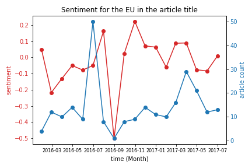

This project was started after seeing Christian Kreuder-sonnen speak at Harvard in Adolphus Busch Hall for a European Union Seminar title: Emergency Powers of International Organizations.

I wanted to expand upon his idea of a 'crisis index' which represents the intensity of a crisis as a function of time.

The thesis of the talk was that there are many factors that decide whether an Internationl Organization 'ratchets' up their authority or diminishes it. Of those many factors, rhetorical power was proposed as the most powerful.

In turn, I propose that rhetorical power can be estimated by measuring the sentiment of the media towards an organization. Where the media sentiment is positive towards an organization, the rhetorical power of that organization is either high or will increase soon. Where the media is negative, an organization will either have low rhetorical power or it will decrease.

I make several assumptions in designing this sentiment tracker.

1. Where the IO (International Organization) is mentioned in the article title, it is the subject of the article
2. The sentiment is best measured by taking the title text as the input
3. The content of the article does not need to be measured
4. The dataset I use is complete enough to encompass all relevant audiences.

___________________

The DATA 

All-the-news, a Kaggle dataset by Snapcrack (thanks!) 
https://www.kaggle.com/snapcrack/all-the-news

also 

AG corpus (not successfully implemented at the time of writing)
http://www.di.unipi.it/~gulli/AG_corpus_of_news_articles.html

___________________


NEXT STEPS:

I encourage future users to track the sentiment towards an organization as both a function of time AND the publication it came from (especially using political compasses of publications to identify different audiences).

I also seek ways of:

1. Accommodating various words and terms used to describe/label/name an IO (e.g EU, European Union)
2. Ensuring that the IO is indeed the subject of the title and not an incidental mention. The final goal is to ensure that the sentiment is TOWARDS the IO, and not AWAY from it directed at another subject.





```python

```
